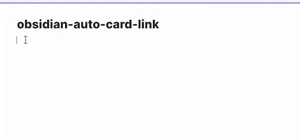
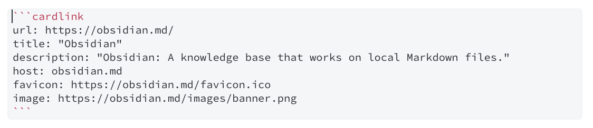

# obsidian-auto-card-link

- Automatically fetches metadata from a url and make it card-styled link.
- Card-styled link is generated by code block which does not mess up your Markdown files unlike HTML tags!






# Feature
- Paste and enhance copied url
- Enhance selected url
- Setting for enhancing default paste


# `cardlink` syntax
The code block `cardlink` uses YAML syntax for displaying card-styled link.


## attributes
|name|required|description|
|---|---|---|
|url|true|url to open when you click the link|
|title|true|title of the link|
|description|false|description of the link|
|host|false|host of the link|
|favicon|false|favicon of the link|
|image|false|thumbnail image to show in the card link|


## example
```
​```cardlink
url: https://obsidian.md/
title: "Obsidian"
description: "Obsidian: A knowledge base that works on local Markdown files."
host: obsidian.md
favicon: https://obsidian.md/favicon.ico
image: https://obsidian.md/images/banner.png
​```
```


# Motivation
- Wanted to show beautiful links in my notes
- Didn't want to mess up my notes with HTML tags
